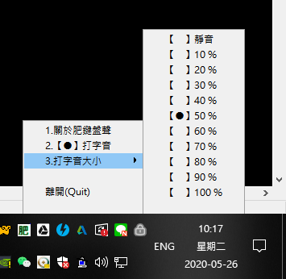

# my_keyboard_sound

讓平凡的鍵盤打起來有機械鍵盤的聲音
 
作者：羽山秋人 (https://3wa.tw) 
版本：V0.05 
最初開發日期：2020-05-25 10:53 
最後更新時間：2021-08-03 09:15 
 

  
   
  影片範例：https://youtu.be/Jz6ipkIPxxE 
  

<h3>開發動機：</h3>
　　之前在FB看到朋友在談論要買機械鍵盤的事情，覺得好像可以作一個電腦軟體版的，閒閒就寫了。 
 
<h3>適用平台：</h3>
<ul>
  <li>（✓）Windows 10</li>
</ul>
 
<h3>使用方法：</h3>
<ul>
  <li>1.下載 dist 目錄下所有檔案 或 <a href="https://github.com/shadowjohn/my_keyboard_sound/blob/master/dist/my_keyboard_sound.zip">my_keyboard_sound.zip</a></li>
  <li>2.解壓縮內容</li>
  <li>3.執行 my_keyboard_sound.exe</li>
  <li>4.右下會出現「肥」功能視窗</li>
  <li>5.從此享受打字有機械鍵盤聲，叮叮噹噹很爽快</li>
</ul>
<h3>開發工具：</h3>
  <ul>
    <li>Python 27 (32BIT)</li>
    <li>pyhook 鍵盤事件勾</li>    
    <li>pyinstaller 可搭配build.bat製作dist/my_keyboard_sound.exe檔</li>
    <li>psutil 用來判斷目前視窗跑什麼，如果是putty、pietty、pcman出字方式要調整</li>
    <li>(Third party) php.py 羽山比較熟php，所以在python裡實作很多php的函式</li>
    <li>(Third party) portalocker.py 防重複執行，會鎖定 my_keyboard_sound.exe 同目錄下的 my_keyboard_sound.lock</li>    
    <li>(Third party) pyaudio 打字音</li>    
  </ul>
<h3>檔案說明：</h3>
  <ul>
    <li>Python 27 (x86版本):【https://www.python.org/ftp/python/2.7.13/python-2.7.13.msi】</li>    
    <li>pyhook【放在p27目錄，點了安裝即可 p27/pyHook-1.5.1.win32-py2.7.exe】，偵測鍵盤按到的事件功能</li>
    <li>run.bat 方便快速執行</li>
    <li>build.bat 打包成單一執行檔</li>
    <li>1.wav ~ 9.wav 打字聲音檔，每次打字會隨機挑一個播放，比較不會單調</li>
    <li>(Third party) php.py 羽山比較熟php，所以在python裡實作很多php的函式</li>
    <li>(Third party) portalocker.py 防重複執行，會鎖住與 my_keyboard_sound.exe 同目錄下的 my_keyboard_sound.lock</li>
    <li>(Third party) traybar.py、win32_adapter.py System Tray 功能，使用我修改過的版本</li>    
  </ul>
<h3>自行編譯：</h3>
  <ul>
    <li>1、請下載並安裝python 27 (x86版) 【https://www.python.org/ftp/python/2.7.13/python-2.7.13.msi】</li>
    <li>2、請設定windows環境變數，在path裡加上 【;c:\Python27;c:\Python27\Scripts】</li>
    <li>3、安裝【p27/pyHook-1.5.1.win32-py2.7.exe】</li>    
    <li>4、至windows cmd，下指令【pip install pyaudio】</li>
    <li>5、至windows cmd，下指令【pip install pyinstaller】</li>    
    <li>6、編成exe的方法，執行【build.bat】，即可將 my_keyboard_sound.exe 編到 dist 目錄下</li>    
  </ul>
<h3>版本更新說明：</h3>
 

    (2020-05-25) V0.01 版：
    初登場
  
    (2020-05-26) V0.02 版：
    增加可以調整音量大小
    
    (2020-05-27) V0.03 版：
    移除 pygtk 套件依賴，改用 traybar

    (2021-08-02) V0.04 版：
    按住不會連續出聲，嘗試修正打太快當機的問題
    自定檔如 backspace.wav、enter.wav、space.wav、delete.wav
    7、加入 ICQ 聲音
    
    (2021-08-03) V0.05 版：
    8、預設音量改成 20%
    9、移除 import pkg_resources
    10、移除測試用 json
        
<h3>補充說明：</h3>
  由於此程式使用 pyhook 開發，比較容易被防毒軟體誤判為 keylogger，有疑慮建議可以自行編譯使用 
  有新版的話，固定會送 Windows Defender 資訊中心掃描進行排除，更新至最新的病毒碼應該都可以安心使用
              
<h3>Todo：</h3>
<ul>
  <li>(Done 2021-08-02)1、消除長壓的聲音</li>
  <li>(Done 2020-05-26)2、聲音大小聲可調整</li>
  <li>3、不同機械鍵盤聲音檔可選</li>
  <li>(Done 2021-08-02)4、backspace、enter、space、delete 聲音可調</li>
  <li>(Done 2020-05-27)5、修正右下角選單被檔住的問題</li>
  <li>6、滑鼠點擊也要有聲音的選項開關</li>
  <li>(Done 2021-08-02)7、加入 ICQ Enter、Delete、Backspace、Space 聲音 </li>
  <li>(Done 2021-08-03)8、預設音量改成 20% </li>
  <li>(Done 2021-08-03)9、移除 import pkg_resources </li>
  <li>(Done 2021-08-03)10、移除 json </li>
  
</ul>
