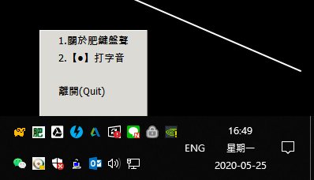

# my_keyboard_sound

讓平凡的鍵盤打起來有機械鍵盤的聲音
 
作者：羽山秋人 (http://3wa.tw) 
版本：V0.01

<h2>使用方法</h2>
下載 dist 目錄下所有檔案 或
  <a href="https://github.com/shadowjohn/my_keyboard_sound/blob/master/dist/my_keyboard_sound.zip">my_keyboard_sound.zip</a>
 
 
解壓縮後執行 my_keyboard_sound.exe  

在右下會出現「肥」功能視窗 
 

  

 
之後打字就會有機械鍵盤聲，叮叮噹噹很爽快~
 
 
Todo: 
1、消除長壓的聲音 
2、聲音大小聲可調整 
3、不同機械鍵盤聲音檔可選 
4、backspace、enter、space 聲音可調 
